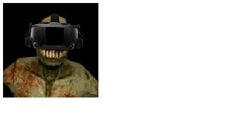

HuskVR is a modification for the early access first person shooter game ULTRAKILL that allows it to be played in VR.

## Installation

TODO

## Requirements

- Legal Steam copy of ULTRAKILL
- SteamVR
- [BepInEx 5](https://github.com/BepInEx/BepInEx/releases/tag/v5.4.21)
- VR headset and controllers (SteamVR recommended, Oculus may work but no promises)

Note that [UMM](https://github.com/Temperz87/ultra-mod-manager) is not required for HuskVR to function.